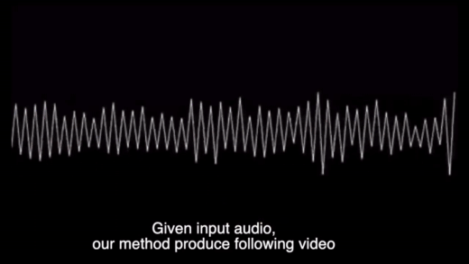

# Speech2Video
This is code for "Speech2Video Synthesis with 3D Skeleton Regularization and Expressive Body Poses". ACCV 2020. [Project Page](https://sites.google.com/view/sibozhang/speech2video) 



## Introduction
We propose a novel approach to convert given speech audio to a photo-realistic speaking video of a specific person, where the output video has synchronized, realistic, and expressive rich body dynamics. We achieve this by first generating 3D skeleton movements from the audio sequence using a recurrent neural network (RNN), and then synthesizing the output video via a conditional generative adversarial network (GAN). To make the skeleton movement realistic and expressive, we embed the knowledge of an articulated 3D human skeleton and a learned dictionary of personal speech iconic gestures into the generation process in both learning and testing pipelines. The former prevents the generation of unreasonable body distortion, while the later helps our model quickly learn meaningful body movement through a few recorded videos. To produce photo-realistic and high-resolution video with motion details, we propose to insert part attention mechanisms in the conditional GAN, where each detailed part, e.g. head and hand, is automatically zoomed in to have their own discriminators. 

## Data / Preprocessing
pretrained model: https://www.dropbox.com/sh/76gftdu15t6n9zx/AACavISLOgk445ktyyjrfeELa?dl=0

## Citation
Speech2Video Synthesis with 3D Skeleton Regularization and Expressive Body Poses

Miao Liao*, Sibo Zhang*, Peng Wang, Hao Zhu, Xinxin Zuo, Ruigang Yang. [PDF](https://arxiv.org/pdf/2007.09198.pdf) [Result Video](https://youtu.be/MUlRtgbGeUs)
[1 min Spotlight](https://youtu.be/04oqf7kDzXo) [10 min Presentation](https://youtu.be/E8Dvef0Z4sw)
```
@article{liao2020personalized,
  title={Personalized Speech2Video with 3D Skeleton Regularization and Expressive Body Poses},
  author={Liao, Miao and Zhang, Sibo and Wang, Peng and Zhu, Hao and Yang, Ruigang},
  journal={arXiv preprint arXiv:2007.09198},
  year={2020}
}
```
## Ackowledgements
This code is based on the vid2vid framework.


